# Event-Driven Workflow Engine — Design Spec

| | |
|---|---|
| **Status** | Draft v1.2 — reviewed, scenario walked through end to end |
| **Owner** | Platform Engineering |
| **Audience** | Backend/platform developers, solution architects |
| **Reference scenario** | Azure Databricks provisioning via GitHub Actions deployment |

## How to read this document

This spec describes an event-driven workflow orchestration engine — the internal equivalent of Logic Apps / n8n / Step Functions — built on React (UI), FastAPI (API), Postgres (state), Azure Service Bus (event queue), and an Azure Function (execution engine). Sections 1–12 define the engine itself: data model, workflow definition format, execution semantics, and API surface. Section 13 walks one real scenario through every layer of the system, because the abstract design only means something once it's been pressure-tested against something concrete. Section 14 specifies the UI screens the frontend needs to build. Section 15 lists what's still open. Appendix A is a decision log, kept so a reader can see not just what was decided but why, and can trace a decision back to the discussion that produced it.

---

## 1. Purpose & Scope

The engine lets a request go through an arbitrary graph of steps — approvals, transformations, external API calls, conditional branches, parallel work, long-running waits, and LLM-driven agentic loops — triggered from the UI today, with the trigger mechanism designed to be pluggable for webhook/schedule/event triggers later. A workflow is authored as JSON (with an optional visual builder on top), versioned, and executed by a horizontally-scalable, at-least-once-tolerant engine.

**In scope for this version:** UI-triggered workflows; parallel and gated approvals; conditional/fan-out/fan-in/loop/agentic node types; JSON import/export; immutable node inputs/outputs with global/run/iteration-scoped variables; per-node execution conditions; a stop signal; runtime variable mutation; externally-referenced connections; workflow and node-kind versioning; retry/timeout policies; React Flow visualization.

**Explicitly out of scope for this version:** sub-workflow composition (calling one workflow from another); triggers other than manual/UI.

---

## 2. Terminology

| Term | Meaning |
|---|---|
| Workflow | A named, versioned graph of nodes. |
| Workflow version | An immutable, published snapshot of a workflow's definition. A run always executes against the exact version it started with. |
| Run | One execution instance of a workflow version, created by a trigger. |
| Node | One step in the graph. Identified by `id`; its behavior is defined by its `kind` + `version`. |
| Node kind | A registered, versioned contract (input/output/config schema, connection roles, default policies, events) that a node instance references. |
| Node execution | The runtime record of one node's execution within one run (or one iteration of a fan-out branch). |
| Event | Something a node kind's executor reports happening — some events are terminal (resolve the node), most are not. |
| Connection | A reference to externally-configured credentials (e.g. a GitHub token), resolved per environment. Never stored in workflow JSON. |

---

## 3. System Architecture

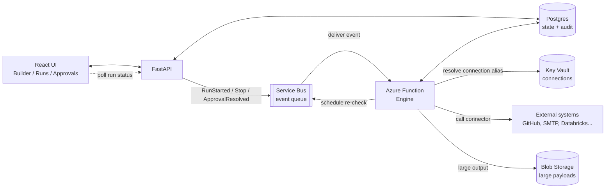

The Engine never talks to the UI directly — every state change lands in Postgres first, so the UI's view of a run is always a read of committed state, never a race with in-flight processing.

The API tier owns writes originating from people: creating/publishing workflows, resolving connection aliases at trigger time, recording approval decisions, issuing stop requests. The Engine owns writes originating from execution: node state transitions, variable mutations, the event log. Neither tier bypasses Postgres to talk to the other directly — Service Bus is the only channel between them, which keeps the Engine horizontally scalable without the API needing to know how many Function instances are running.

---

## 4. Data Model

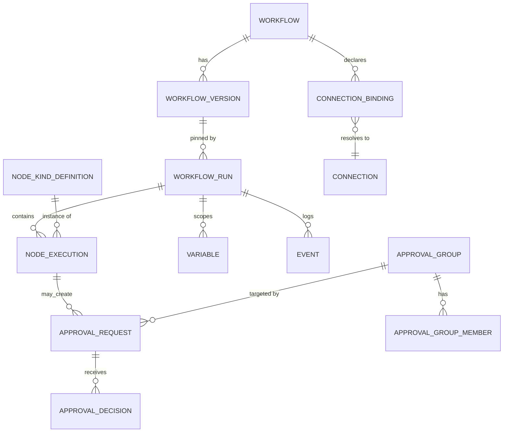

### workflow_version

| Column | Type | Notes |
|---|---|---|
| `id` | uuid | Primary key. |
| `workflow_id` | uuid | FK to workflow. |
| `version_number` | int | Monotonic per workflow, assigned on publish. |
| `status` | enum | draft / published / archived. |
| `definition` | jsonb | The full workflow JSON — immutable once published. |
| `published_at` | timestamptz | Null while draft. |

### workflow_run

| Column | Type | Notes |
|---|---|---|
| `id` | uuid | Primary key. |
| `workflow_version_id` | uuid | Pinned at trigger time — never changes for the life of the run. |
| `status` | enum | See §7.1. |
| `trigger_payload` | jsonb | Immutable input the run started with. |
| `connection_bindings` | jsonb | Alias → connection map, resolved once at trigger time. |
| `stop_requested_at` | timestamptz | Set by the API; the Engine checks this before starting any new node. |

### node_execution

| Column | Type | Notes |
|---|---|---|
| `id` | uuid | Primary key. |
| `run_id` | uuid | FK to workflow_run. |
| `node_id` | text | Node id from the workflow definition. |
| `iteration_key` | text | Null for single-shot nodes; branch index for a fan-out instance. |
| `attempt` | int | Increments on retry only — not on a poll recheck. |
| `idempotency_key` | text | `run_id:node_id:iteration_key:attempt` — unique constraint. A redelivered message that finds this row already terminal is a no-op. |
| `status` | enum | See §7.2 — what the graph acts on. |
| `input_snapshot` | jsonb | Resolved inputs after JSONata evaluation (not the raw expressions). |
| `state` | jsonb | Opaque scratchpad only the node kind's own executor reads and writes — internal phase, counters, anything needed across repeated invocations while non-terminal. The Engine merges it in and passes it back; it never inspects the contents (§6.2). |
| `output` | jsonb / blob ref | Set once, on the terminal event. This — **not** `state` — is what `$node('id').output` exposes downstream. Inlined under a size threshold, otherwise a Blob Storage reference. |

### event (append-only audit log)

| Column | Type | Notes |
|---|---|---|
| `run_id` | uuid | FK to workflow_run. |
| `sequence` | bigint | Monotonic per run — the ordering the UI replays to render run history. |
| `event_type` | text | `NodeStarted`, `NodeSucceeded`, `ApprovalRequested`, `VariableSet`, `StopRequested`, or any kind-specific event (§6.2). |
| `payload` | jsonb | Event-specific detail. |

The event log is what makes the Engine debuggable and resumable without being a full event-sourced system: `node_execution` is always the current-state view an Engine instance queries to decide what to do next; `event` is the immutable trail a human reads to answer "what happened, and when."

**Audit trail completeness.** Every event is captured here — terminal or not, whether raised by a node kind's executor (§6.2's full catalogue: `Checked`, `DecisionRecorded`, `RunProgressed`, and every other non-terminal event, not only the ones that resolve a node) or by the Engine's own orchestration (`RunStarted`, `NodeReady`, `StopRequested` — events with no owning kind, because they describe the run itself rather than one node's work). This isn't a policy the executor has to remember to follow: the dispatch loop in §6.3 appends whatever the executor returned to the event log *before* it even checks whether that event is terminal, so there's no code path that produces an event without logging it. Rows are appended only — nothing is ever updated in place or deleted. The Audit Trail screen (§14.5) is a direct, unfiltered read of this table ordered by `sequence`; nothing that happens during a run is invisible to it.

### workflow

| Column | Type | Notes |
|---|---|---|
| `id` | uuid | Primary key — stable across every version. |
| `name` | text | Display name shown in the Catalogue (§14.6). |
| `owner` | text | Team or user of record; who Publish/Archive permissions check against. |
| `created_at` | timestamptz | |

### variable

| Column | Type | Notes |
|---|---|---|
| `scope` | enum | `global` / `run` / `iteration` (§5.2) — `trigger` is never stored here, it's read straight off `workflow_run.trigger_payload`. |
| `scope_id` | text | What the scope resolves against: null for `global`, `run_id` for `run`, `run_id:node_id:iteration_key` for `iteration`. |
| `name` | text | Together with `scope`/`scope_id`, the natural key. |
| `value` | jsonb | Current value. |
| `access` | enum | `ro` / `rw`, copied from the declaration at the point the value was first set — publish-time validation (§5.2) is what actually stops a `ro` write, this is just what a reader sees. |
| `updated_at` | timestamptz | |
| `updated_by_node_execution_id` | uuid | FK to `node_execution` — which `control.setVariable` (or engine-internal) write last changed this value. |

Every row here is the *current* value only — the full history of who changed a variable and when is the `event` table's `VariableSet` rows (§6.2), keyed by the same `scope`/`scope_id`/`name` in their `payload`, not a separate history table. "Current state" and "history" stay one system instead of two that can drift.

### connection

| Column | Type | Notes |
|---|---|---|
| `id` | uuid | Primary key. |
| `type` | text | e.g. `github`, `smtp` — what a node's `connections` role requirement is checked against. |
| `type_version` | int | See §16.4 — connection types version the same way node kinds do. |
| `name` | text | Human label shown in the Connections tab (§14.1). |
| `metadata` | jsonb | Non-secret configuration (e.g. a GitHub App's installation id). |
| `secret_ref` | text | Key Vault reference — the secret material itself never enters Postgres. |

### connection_binding

| Column | Type | Notes |
|---|---|---|
| `workflow_id` | uuid | FK to workflow. |
| `alias` | text | The name a workflow's `connections` declaration and its nodes' `connections` maps reference (§5.5). |
| `environment` | text | `dev` / `staging` / `prod`, … — what makes the same published JSON promote untouched (§9). |
| `connection_id` | uuid | FK to connection. |

### node_kind_definition

| Column | Type | Notes |
|---|---|---|
| `kind` | text | e.g. `action.github.commit` — together with `version`, the primary key. |
| `version` | int | See §16.4 for what forces a bump. |
| `category` | text | Palette grouping (§6.1). |
| `input_schema` / `output_schema` / `config_schema` | jsonb | Each built from the §5.1 field shape — this is the registry entry §6.4 documents per kind. |
| `connection_roles` | jsonb | Named roles this kind requires (§5.5) — zero, one, or several. |
| `default_policies` | jsonb | `retry`/`timeout` defaults (§10) a node instance can override. |
| `events` | jsonb | The full event catalogue for this kind (§6.2) — `type`, `terminal`, `resultStatus`, `description`. |
| `deprecated` | boolean | See §16.4 — blocks new usage, never affects already-published workflows. |
| `deprecated_message` | text | Shown in the Designer when an author opens a node already on a deprecated version. |

### approval_group

| Column | Type | Notes |
|---|---|---|
| `id` | text | e.g. `platform-leads` — this is the `groupId` an `approval` node's `config` references (§6.4). |
| `name` | text | Display name. |
| `description` | text | Shown to approvers for context on what this group is trusted to sign off on. |

### approval_group_member

| Column | Type | Notes |
|---|---|---|
| `group_id` | text | FK to approval_group. |
| `member_type` | enum | `human` or `agent` — see §8.1's agent-evaluated approvals. |
| `identity` | text | Email for a `human` member; a connection alias (resolving to the model/agent connector) for an `agent` member. |
| `auto_decide` | boolean | Only meaningful for `agent` members — `true` means the Engine invokes this member's decision inline when a request is created (§8.1); `false` means the agent is expected to self-poll `GET /approvals/pending` on its own schedule, exactly like a human's client would. |

### approval_request

| Column | Type | Notes |
|---|---|---|
| `id` | uuid | Primary key — what `POST /approvals/{id}/decision` addresses. |
| `node_execution_id` | uuid | FK to node_execution — the specific `approval` node instance this request belongs to. |
| `group_id` | text | FK to approval_group. |
| `quorum` | int | Copied from the node's `config.quorum` at request-creation time. |
| `decision_instructions` | text | Resolved (JSONata-evaluated) copy of the node's `config.decisionInstructions` (§8.1) — the guidance a human sees inline and an agent member reads as its decision policy. Snapshotted here, not re-resolved per read, so what an approver acted on is exactly what the audit trail can show later. |
| `status` | enum | `Pending` / `QuorumReached` / `Rejected` / `TimedOut` — mirrors the node's own terminal events (§6.2). |
| `created_at` | timestamptz | |

### approval_decision

| Column | Type | Notes |
|---|---|---|
| `id` | uuid | Primary key. |
| `request_id` | uuid | FK to approval_request. |
| `member_id` | text | Which approval_group_member decided. |
| `decided_by_type` | enum | `human` or `agent`, copied from the member at decision time — what the Audit Trail (§14.5) and the event's `payload` both surface, so "an agent approved this" is never ambiguous after the fact. |
| `decision` | enum | `approve` / `reject`. |
| `comment` | text | Optional for a human; for an `auto_decide` agent this is where its rationale is recorded (§8.1). |
| `decided_at` | timestamptz | |

---

## 5. Workflow Definition Format

### 5.1 Field schema convention

Every schema-defining block in the system — a trigger's `payloadSchema`, a variable declaration, a node kind's declared input/output/config schema — uses one field shape:

```json
{ "type": "string", "label": "Resource Name", "description": "...", "required": true, "default": "..." }
```

`label` and `description` are what the visual builder shows a person filling in a form; `default` is optional and only meaningful when the field isn't `required`.

### 5.2 Variables & scopes

`variables` is a dictionary keyed by **scope**, then by name — never an array, so both the scope and the name are unambiguous from the key path itself:

```json
"variables": {
  "global": {
    "defaultRegion": { "type": "string", "access": "ro", "label": "Default Region",
                        "description": "Fallback Azure region used when a request omits one", "default": "eastus" }
  },
  "run": {
    "deploymentBranch": { "type": "string", "access": "rw", "label": "Deployment Branch",
                           "description": "Git branch the deployment JSON is committed to for this run" }
  }
}
```

| Scope key | Lifetime | Declared where |
|---|---|---|
| `trigger` | Life of the run | Not in `variables` at all — it's `trigger.payloadSchema`, and always read-only. |
| `global` | Persists across runs, shared across workflows | Registered once in the platform's global registry; a workflow's `variables.global` block only lists the ones it actually reads or writes, for validation and builder autocomplete. |
| `run` | Life of this run | `variables.run`, in this workflow's own definition. |
| `iteration` | One `control.forEach` iteration, discarded after | Inside that `forEach` node's own `config`, not the top-level `variables` block — it doesn't exist outside that loop. |

A reference is always `$vars.<scope key>.<name>` — e.g. `$vars.global.defaultRegion`, `$vars.run.deploymentBranch` — so scope travels with every expression, not just the declaration.

A `control.setVariable` node execution takes a row lock (`SELECT … FOR UPDATE`) on the target variable before writing, so two parallel branches racing to update the same `rw` variable serialize instead of silently losing one write. Publish-time validation rejects any workflow that targets a variable declared `ro`.

### 5.3 Run context

Alongside `$trigger`, `$vars`, and `$node`, every expression can read `$context` — engine-assembled, always read-only, never something a workflow author sets:

| Field | Meaning |
|---|---|
| `$context.workflowId` | The workflow's stable id — constant across every version. |
| `$context.workflowVersion` | The pinned version number this run is executing. |
| `$context.runId` | This run's id, matching `workflow_run.id`. |
| `$context.environment` | The environment connection aliases were resolved against. |
| `$context.startedAt` / `.startedBy` | When the run was triggered, and by whom. |
| `$context.node.id` / `.attempt` / `.iterationKey` | Identifies the node execution currently evaluating the expression. |

**Expressions are JSONata.** `$trigger`, `$vars.<scope>.<name>`, `$node('id').output` / `$node('id').status`, and `$context` are the reference roots every node input, `when`, and edge `metadata` can draw from — never a raw variable name, so a schema linter can statically catch a typo'd reference at publish time rather than run time. Edge `metadata` is resolved exactly like a node's `inputs` — every value is a JSONata expression; a fixed label is just a string literal (`'approved'`) — nothing in the mechanism distinguishes "static" from "computed."

### 5.4 Control flow lives on the node

Each node carries its own `next` list of successors — target id, optional `when` guard, optional `metadata` map. There is no separate top-level edge array: the Engine derives every node's structural predecessors by scanning who names it in their `next`. Visual position is a separate `layout` block the Engine never reads.

- **Static fan-out** needs no special kind: a node with more than one `next` entry and no discriminating `when` has every target become eligible independently.
- **Dynamic fan-out** (an unknown-until-runtime array) is `control.forEach` — it creates one `node_execution` of its child node per array item, each with a distinct `iteration_key`, up to a concurrency cap.
- **Fan-in** has no dedicated kind: it's the `join` field on whichever downstream node has more than one structural predecessor — `all` (default), `any`, or an explicit N-of-M count, evaluated against exactly the predecessors the graph shape gives it.

### 5.5 Connections

A node doesn't reference a connection alias directly — it maps its own required roles to workflow-level aliases, since a node can need more than one connection at once:

```json
"connections": { "repo": "github-deploy", "source": "azure-blob-artifacts" }
```

The registry entry for the node's kind declares which roles are required and what connection type each expects (§6.1); the workflow author fills in which alias plays which role, and publish-time validation checks the type matches. See §10 for alias resolution.

### 5.6 Worked example (abbreviated)

```json
{
  "workflowId": "wf_databricks_provision",
  "version": 1,
  "metadata": { "name": "Provision Azure Databricks", "owner": "platform-eng" },

  "connections": [
    { "alias": "github-deploy", "type": "github" },
    { "alias": "smtp-notify",   "type": "smtp"   }
  ],

  "variables": {
    "global": {
      "defaultRegion": { "type": "string", "access": "ro", "label": "Default Region",
                          "description": "Fallback Azure region used when a request omits one", "default": "eastus" }
    },
    "run": {
      "deploymentBranch": { "type": "string", "access": "rw", "label": "Deployment Branch",
                             "description": "Git branch the deployment JSON is committed to for this run" }
    }
  },

  "trigger": {
    "kind": "manual",
    "payloadSchema": {
      "resourceName":   { "type": "string", "label": "Resource Name",   "description": "Name of the resource that will be created in Azure", "required": true },
      "region":         { "type": "string", "label": "Azure Region",    "description": "Target Azure region for the deployment", "required": true, "default": "eastus" },
      "requesterEmail": { "type": "string", "label": "Requester Email", "description": "Where the completion notification is sent", "required": true }
    },
    "next": [ { "to": "approve-platform" }, { "to": "approve-security" } ]
  },

  "onError": { "to": "notifyOpsFailure" },

  "nodes": [
    {
      "id": "approve-platform", "kind": "approval", "version": 1,
      "name": "Platform leads approval",
      "config": { "groupId": "platform-leads", "quorum": 1 },
      "next": [ { "to": "bothApproved" } ]
    },
    {
      "id": "approve-security", "kind": "approval", "version": 1,
      "name": "Security review approval",
      "config": { "groupId": "security-review", "quorum": 2 },
      "next": [ { "to": "bothApproved" } ]
    },
    {
      "id": "bothApproved", "kind": "control.switch", "version": 1,
      "name": "Both groups approved?",
      "join": "all",
      "next": [
        { "to": "buildJson",
          "when": "$node('approve-platform').status='Succeeded' and $node('approve-security').status='Succeeded'",
          "metadata": { "label": "'approved'" } },
        { "to": "notifyRejected",
          "when": "$node('approve-platform').status='Failed' or $node('approve-security').status='Failed'",
          "metadata": { "label": "'rejected by ' & ($node('approve-platform').status='Failed' ? 'platform-leads' : 'security-review')" } }
      ]
    },
    {
      "id": "buildJson", "kind": "action.transform.jsonBuild", "version": 1,
      "inputs": { "resourceName": "$trigger.resourceName", "region": "$vars.global.defaultRegion" },
      "next": [ { "to": "commit" } ]
    },
    {
      "id": "commit", "kind": "action.github.commit", "version": 1,
      "connections": { "repo": "github-deploy" },
      "inputs": {
        "branch": "$vars.run.deploymentBranch",
        "path": "'deployments/' & $trigger.resourceName & '-' & $context.runId & '.json'",
        "content": "$node('buildJson').output"
      },
      "policies": {
        "retry":   { "maxAttempts": 3, "backoff": "exponential", "initialDelaySeconds": 15 },
        "timeout": { "seconds": 60 }
      },
      "next": [ { "to": "awaitWorkflowRun" } ]
    },
    {
      "id": "awaitWorkflowRun", "kind": "action.github.awaitWorkflowRun", "version": 1,
      "connections": { "repo": "github-deploy" },
      "inputs": { "commitSha": "$node('commit').output.commitSha" },
      "config": {
        "locate": { "intervalSeconds": 10, "maxDurationSeconds": 300 },
        "await":  { "intervalSeconds": 30, "maxDurationSeconds": 1800 }
      },
      "next": [
        { "to": "notify",             "when": "$node('awaitWorkflowRun').output.conclusion='success'" },
        { "to": "notifyDeployFailed", "when": "$node('awaitWorkflowRun').output.conclusion!='success'" }
      ]
    },
    {
      "id": "notify", "kind": "action.email.send", "version": 1,
      "connections": { "smtp": "smtp-notify" },
      "inputs": { "to": "$trigger.requesterEmail", "subject": "'Databricks deployment complete (run ' & $context.runId & ')'" },
      "next": []
    },
    {
      "id": "notifyDeployFailed", "kind": "action.email.send", "version": 1,
      "connections": { "smtp": "smtp-notify" },
      "inputs": { "to": "$trigger.requesterEmail", "subject": "'Databricks deployment failed (run ' & $context.runId & ')'" },
      "next": []
    },
    {
      "id": "notifyRejected", "kind": "action.email.send", "version": 1,
      "connections": { "smtp": "smtp-notify" },
      "inputs": { "to": "$trigger.requesterEmail", "subject": "'Databricks request was rejected (run ' & $context.runId & ')'" },
      "next": []
    },
    {
      "id": "notifyOpsFailure", "kind": "action.email.send", "version": 1,
      "connections": { "smtp": "smtp-notify" },
      "inputs": { "to": "'platform-eng-oncall@company.example'",
                  "subject": "'Workflow error (run ' & $context.runId & ')'" },
      "next": []
    }
  ],

  "layout": { "approve-platform": { "x": 40, "y": 40 }, "approve-security": { "x": 40, "y": 160 } }
}
```

`buildJson`'s actual output depends on what the target repo's pipeline consumes — Terraform tfvars, a Bicep parameters file, or a custom manifest. The shape implied above (`resourceType`, `name`, `region`, `requestedBy`, `runId`) is a placeholder — **confirm against the real deployment repo before finalizing this node's schema.**

---

## 6. Node Kind Registry

### 6.1 Kind catalogue

A node in a workflow definition is a reference, not a description — the contract lives in a registry entry keyed by `kind` and `version`, so a published workflow can't silently change behavior when a connector is updated.

| Category | Example kind | Purpose |
|---|---|---|
| trigger | `trigger.manual` | Workflow entry point. Not a `node_execution` — its lifecycle is the single workflow-level `RunStarted` event (§4), since there's nothing for it to execute against. |
| action | `action.github.commit` | Single unit of work against a connector. |
| approval | `approval` | Single-group sign-off gate. Multi-group approval composes several of these (§8.1). |
| control | `control.switch` | No-op branch point: a `join` policy plus guarded `next` entries. |
| fan-out | `control.forEach` | Dynamic parallel branches over a runtime array, with a concurrency cap. Static fan-out needs no dedicated kind (§5.4). |
| loop | `control.pollUntil` | Single-condition retry-until-condition (§8.4). |
| custom composite | `action.github.awaitWorkflowRun` | Purpose-built, multi-phase wait — see §6.2, §8.4, §13.2. |
| agentic | `agent.loop` | LLM-driven tool-calling loop with iteration/cost/timeout caps. |
| variable | `control.setVariable` | Writes a scoped or global `rw` variable. |
| terminal | `control.stop` | Node-initiated graceful stop. |

Every registry entry declares: an input schema, output schema, and optional config schema (all built from the §5.1 field shape); the named connection roles it requires (zero, one, or several — §5.5); and default `policies` (§11) a node instance can override. This is also the palette the visual builder reads to render the node picker — it never hardcodes a node list. There's no dedicated fan-in kind, per §5.4.

### 6.2 Node event model

A kind's manifest declares the events it can raise, and which of those are **terminal** — the ones that resolve the node to a final status and let the Engine move on to its `next` list. Not every non-terminal event is inert: some move the node through internal phases without the graph ever seeing it.

Each event in the manifest uses the same descriptive shape as everything else in this spec (§5.1) — a `type`, whether it's `terminal`, the `resultStatus` it maps to when it is, and a plain-language `description`. This is what a workflow author actually sees while building: the Designer's node inspector (§14.1) renders this catalogue for whatever node is selected, so "what can this node do, and what does each of those outcomes mean" is answered without reading the executor's source. `GET /node-kinds` returns exactly this shape:

```json
{
  "kind": "approval", "version": 1,
  "events": [
    { "type": "Requested", "terminal": false,
      "description": "The request was created and every member of the approver group was notified." },
    { "type": "DecisionRecorded", "terminal": false,
      "description": "One approver recorded a decision. Emitted once per decision; quorum may not yet be met." },
    { "type": "QuorumReached", "terminal": true, "resultStatus": "Succeeded",
      "description": "Enough approve decisions were recorded to satisfy the configured quorum." },
    { "type": "Rejected", "terminal": true, "resultStatus": "Failed",
      "description": "An approver rejected the request under a policy where any rejection fails the node immediately." }
  ]
}
```

**Full catalogue, every kind.** This is the source of truth both for what the inspector renders and for what the Audit Trail (§14.5) can ever show — nothing reaches the `event` table under a name that isn't listed here.

| Kind | Event | Terminal → status | Description |
|---|---|---|---|
| `action.*` (`github.commit`, `email.send`, `transform.jsonBuild`) | `Started` | no | The connector call — or, for `jsonBuild`, the template evaluation — began. |
| | `Completed` | → Succeeded | The unit of work finished normally; `output` is the connector's (or transform's) result. |
| | `Errored` | → Failed | The call failed or the expression threw. `policies.retry` (§10) governs whether this is retried before the node's status is set. |
| `approval` | `Requested` | no | The request was created and every member of the approver group was notified. |
| | `DecisionRecorded` | no | One approver recorded a decision. Emitted once per decision; quorum may not yet be met. |
| | `QuorumReached` | → Succeeded | Enough approve decisions were recorded to satisfy the configured quorum. |
| | `Rejected` | → Failed | An approver rejected under a policy where any rejection fails the node immediately. |
| `control.switch` | `Evaluated` | → Succeeded | Branch expressions were evaluated against current outputs/variables and a matching (or default) branch was selected. |
| `control.forEach` | `IterationStarted` | no | A new iteration began for the next item in the source array. |
| | `IterationCompleted` | no | One iteration's sub-branch finished; its result was recorded. |
| | `Completed` | → Succeeded | Every iteration finished (or was skipped); results were collected into `output`. |
| | `Errored` | → Failed | An iteration failed under a fail-fast policy, stopping the remaining iterations. |
| `control.setVariable` | `VariableSet` | → Succeeded | The named variable was written in its declared scope. A matching row is also appended to that variable's own change history, independent of which node made the change (§8.3). |
| `control.pollUntil` | `Started` | no | The first check of the configured condition ran. |
| | `Checked` | no | A scheduled recheck ran; the condition was not yet satisfied. |
| | `ConditionMet` | → Succeeded | The configured condition evaluated true. |
| | `ConditionFailed` | → Failed | The condition evaluated to an explicit failure state — not merely "not yet." |
| | `MaxDurationExceeded` | → Failed | The condition never became true before the node's configured max duration elapsed. |
| `control.stop` | `Terminated` | ends the **run**, not just this node | Execution reached this node; the run was ended immediately with the configured status and every other in-flight node was marked `Skipped`. |
| `action.github.awaitWorkflowRun` | `LocateStarted` | no | Began polling GitHub's list-runs endpoint for a run matching this commit's `head_sha`. |
| | `LocateProgressed` | no | A locate-phase check ran; no matching run was found yet. |
| | `RunLocated` | no (phase-changing) | A run matching `head_sha` was found; switched from the locating phase to the watching phase. |
| | `LocateTimedOut` | → Failed | No matching run appeared before the locate phase's own max duration elapsed. |
| | `RunProgressed` | no | A watch-phase check ran; the run is still in progress. |
| | `RunSucceeded` | → Succeeded | The located run completed with a successful conclusion. |
| | `RunFailed` | → Failed | The located run completed with a failing conclusion. |
| | `AwaitTimedOut` | → Failed | The run never reached a terminal conclusion before the watch phase's own max duration elapsed. |
| `agent.loop` | `Started` | no | The loop began; the agent received its goal and tool definitions. |
| | `IterationStarted` | no | A new reasoning turn began. |
| | `ToolInvoked` | no | The agent called one of its available tools; the result is fed back into its next turn. |
| | `IterationCompleted` | no | A reasoning turn finished; the running transcript was updated. |
| | `StoppedByModel` | → Succeeded | The agent determined its goal was satisfied and returned a final result. |
| | `MaxIterationsExceeded` | → Failed | The configured iteration cap was reached without the agent stopping itself. |
| | `MaxCostExceeded` | → Failed | The configured token/cost budget was exhausted before the agent stopped itself. |
| | `TimedOut` | → Failed | `policies.timeout` elapsed before the agent stopped itself. |
| `trigger.manual` | `RunStarted` | workflow-level, not node-terminal | The trigger payload was validated against `payloadSchema` and connection bindings were resolved for this environment; the run begins. `nodeId` is empty on this row — see §4. |

Two things worth calling out explicitly:

- **Not every kind needs its own timeout event.** A plain `action.*` node relies on the generic, Engine-enforced `policies.timeout` (§10) — the Engine itself fails the node and logs it, with no participation from the kind's executor. `control.pollUntil` and `action.github.awaitWorkflowRun` are the exception: they manage more than one internal phase, each potentially with its own duration budget, so *they* own naming and raising their own timeout events (`MaxDurationExceeded`, `LocateTimedOut`, `AwaitTimedOut`) instead of relying on one node-level timeout that couldn't tell the phases apart.
- **`control.stop` is the one kind whose terminal event isn't scoped to the node.** Every other terminal event resolves that node and lets the Engine evaluate `next` from there. `Terminated` instead reaches into the `workflow_run` row directly and marks every other still-pending `node_execution` in the run `Skipped` — it's a deliberate early exit for the whole run, authored into the graph, as distinct from the external `POST /runs/{runId}/stop` (§8.3, §11) as a Logic Apps "Terminate" action is from an operator killing a job.

`control.pollUntil` is for a single condition against a single value — "wait until this variable changes," "wait until this timestamp passes." It stops being the right tool the moment a wait has more than one distinct phase, or needs real API-specific knowledge to run (like the head_sha correlation in §13.2) — that's when it earns its own kind instead of being contorted into `checkExpression` strings nobody can read. Either way it's still **one node** in the graph: the phases live inside the kind's own state machine, never as a second node.

### 6.3 How the Engine handles an event

Every kind ships an executor — the code the Engine actually calls. Each invocation gets back whatever `state` the node saved last time, does one unit of work, and returns an event plus updated state. What the Engine does with that is mechanical, and identical for every kind:

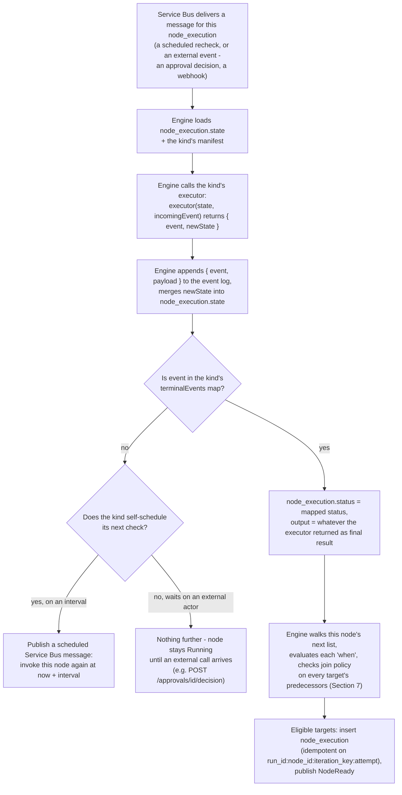

The distinction that matters: `state` is scratch space only the kind's own executor ever reads — the Engine merges it in and hands it back next time without looking inside. `output` is set exactly once, on the terminal event, and it's the only one of the two `$node('id')` exposes downstream. A node can rewrite its `state` a dozen times while Running; nothing downstream sees any of it until `output` exists.

**Worked trace — `action.github.awaitWorkflowRun`.** One node, two phases, tracked entirely in `state.phase`:

| Tick | Event | Terminal? | `state.phase` | Node status | Engine does |
|---|---|---|---|---|---|
| T+0s | LocateStarted | no | locating | Running | schedule recheck at T+10s |
| T+10s | LocateProgressed | no | locating | Running | schedule recheck at T+20s |
| T+20s | RunLocated | no | watching | Running | switch cadence, schedule at T+50s |
| T+50s | RunProgressed | no | watching | Running | schedule recheck at T+80s |
| T+80s | RunProgressed | no | watching | Running | schedule recheck at T+110s |
| T+110s | RunSucceeded | **yes** | watching | Succeeded | set output, evaluate next — `notify` becomes eligible |

`RunLocated` is the one people expect to be terminal and isn't — it changes something real (the phase, the polling cadence, which GitHub endpoint the next check even calls) without resolving the node. That's the point of giving a kind its own phases: the graph only ever sees one thing happen to this node, at T+110s.

### 6.4 Full manifest reference, every kind

§6.1–§6.2 describe the registry in the abstract; this is what `node_kind_definition` (§4) actually holds for each kind today — every config/input field (in the §5.1 shape), what the terminal output looks like, which connection roles it needs, and its default policies. This is the table the Designer's node inspector (§14.1) renders from, field for field.

**`trigger.manual`** — not a `node_execution`, so it has no config/input/output/connections/policies of its own; what a trigger declares is entirely `trigger.payloadSchema` (§5.6), which is author-defined per workflow, not fixed by this kind.

**`approval`**

| Field | In | Type | Required / default | Description |
|---|---|---|---|---|
| `groupId` | config | string | required | Which `approval_group` (§4) this request targets. |
| `quorum` | config | int | default `1` | Approve decisions needed before `QuorumReached`. |
| `decisionInstructions` | config | string (JSONata) | optional | Guidance a human sees inline and an `agent` member reads as its decision policy — §8.1. |
| `timeoutHours` | config | int | optional | Drives `ApprovalTimedOut` if set; unset means the request waits indefinitely. |

Output (on `QuorumReached`): `{ decisions: [{ memberId, decidedByType, decision, comment, decidedAt }], quorumMet }`. Connections: none, unless a member has `auto_decide: true` (§8.1), which requires an `agent` role resolving to a model connector. Policies: `timeout` is expressed via `config.timeoutHours` instead of the generic `policies.timeout` (§10), since it's a business duration, not a call budget.

**`control.switch`** — no config or input schema of its own; every branch condition lives in the node's own `next[].when` (§5.4). Output: `{ matchedBranch, value }`. No connections, no policies — pure and synchronous.

**`control.forEach`**

| Field | In | Type | Required / default | Description |
|---|---|---|---|---|
| `sourceExpression` | config | string (JSONata) | required | Evaluated once against prior output to get the array to iterate. |
| `concurrency` | config | int | default `1` | Max iterations running at once. |
| `failFast` | config | boolean | default `true` | Whether one iteration failing stops the rest (`LoopFailed`) or all run to completion regardless. |

Output: array of each iteration's child-branch terminal output, in source order. Connections/policies: none of its own — its child nodes declare theirs; `policies.timeout` here (if set) bounds the whole loop, not any one iteration.

**`control.setVariable`**

| Field | In | Type | Required / default | Description |
|---|---|---|---|---|
| `scope` | config | enum | required | `global` / `run` / `iteration` (§5.2). |
| `name` | config | string | required | Variable name within that scope. |
| `valueExpression` | config | string (JSONata) | required | Evaluated once to produce the new value. |

Output: `{ scope, name, newValue }`. No connections, no policies.

**`control.pollUntil`**

| Field | In | Type | Required / default | Description |
|---|---|---|---|---|
| `checkExpression` | config | string (JSONata) | required | Evaluated each tick against the connector's response; true → `ConditionMet`. |
| `failExpression` | config | string (JSONata) | optional | True → `ConditionFailed` instead of retrying. |
| `intervalSeconds` | config | int | default `30` | Delay between ticks. |
| `maxDurationSeconds` | config | int | required | Owned by this kind, not `policies.timeout` (§6.2's callout) — exceeding it is `MaxDurationExceeded`. |

Output: the last checked value. Connections: one role (name is deployment-specific, typically `target`) — whatever system `checkExpression` is evaluated against. Policies: none at the node level; see `maxDurationSeconds` above.

**`control.stop`**

| Field | In | Type | Required / default | Description |
|---|---|---|---|---|
| `resultStatus` | config | enum | required | `Succeeded` / `Failed` / `Cancelled` — what the *run* is stamped with. |
| `message` | config | string (JSONata) | optional | Recorded as the reason on `Terminated`. |

Output: `{ reason }`. No connections, no policies — see §6.2's note on why this kind's terminal event isn't node-scoped.

**`action.transform.jsonBuild`**

| Field | In | Type | Required / default | Description |
|---|---|---|---|---|
| `template` | config | jsonb | required | A JSON tree whose leaf strings are JSONata expressions, resolved into the output (§5.6). |

Output: the built JSON object. No connections. Policies: the generic `policies.retry`/`policies.timeout` (§10) apply but are rarely needed for a pure evaluation.

**`action.github.commit`**

| Field | In | Type | Required / default | Description |
|---|---|---|---|---|
| `branch` | input | string | required | Target branch. |
| `path` | input | string | required | File path within the repo. |
| `content` | input | any | required | File content — typically `$node('buildJson').output`. |

Output: `{ commitSha, htmlUrl }`. Connections: one role, `repo` (type `github`). Policies default: retry 3 attempts exponential / timeout 60s.

**`action.email.send`**

| Field | In | Type | Required / default | Description |
|---|---|---|---|---|
| `to` | input | string | required | Recipient. |
| `subject` | input | string | required | |
| `body` | input | string | optional | Defaults to a platform template if omitted. |

Output: `{ messageId }`. Connections: one role, `smtp` (type `smtp`). Policies default: retry 3 attempts / timeout 30s.

**`action.github.awaitWorkflowRun`**

| Field | In | Type | Required / default | Description |
|---|---|---|---|---|
| `commitSha` | input | string | required | Correlates to the run via GitHub's `head_sha` filter (§13.2). |
| `locate.intervalSeconds` / `locate.maxDurationSeconds` | config | int | default `10` / `300` | Locate-phase cadence and budget. |
| `await.intervalSeconds` / `await.maxDurationSeconds` | config | int | default `30` / `1800` | Watch-phase cadence and budget. |

Output: `{ ghRunId, conclusion, htmlUrl }`. Connections: one role, `repo` (type `github`). Policies: none at the node level — both phases own their own duration budgets, per §6.2's callout.

**`agent.loop`**

| Field | In | Type | Required / default | Description |
|---|---|---|---|---|
| `goal` | config | string (JSONata) | required | The instructions/prompt the agent reasons from. |
| `maxIterations` | config | int | default `10` | Hard cap independent of `policies.timeout`. |
| `maxCostUsd` | config | number | optional | Token/cost budget; exceeding it is `MaxCostExceeded`. |
| `tools` | config | array\<string\> | optional | Which platform tools the loop may call. |

Output: `{ result, transcriptSummary }`. Connections: one role, `model` (type `llm`). Policies: `policies.timeout` bounds the whole loop; `maxIterations`/`maxCostUsd` are the kind's own internal caps, the same pattern as `pollUntil`/`awaitWorkflowRun` owning multi-phase budgets.

---

## 7. Execution State Machine

### 7.1 WorkflowRun

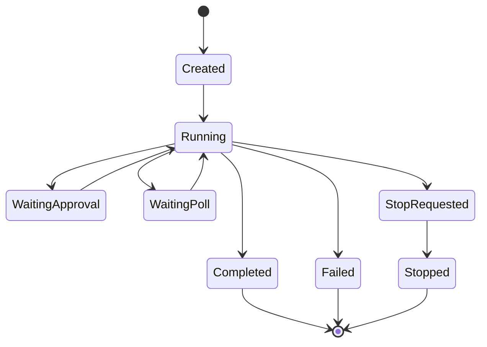

### 7.2 NodeExecution

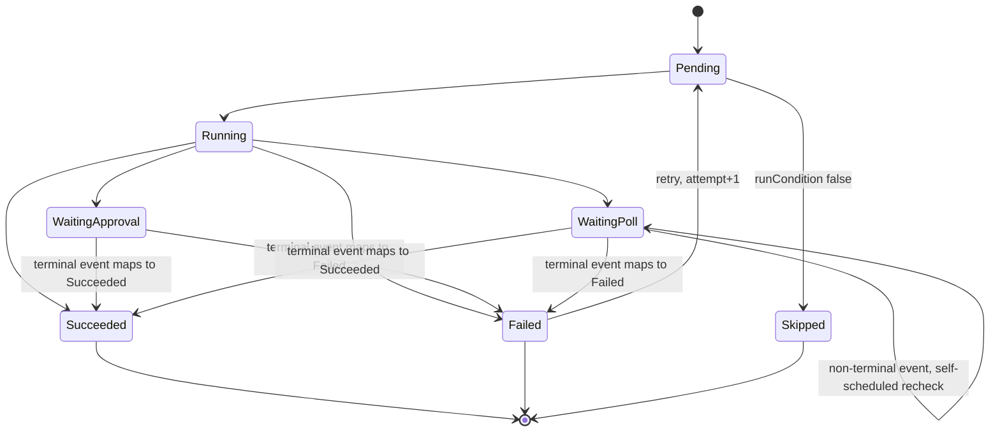

### 7.3 Core engine loop

The Engine's core loop is a single rule applied on every Service Bus delivery: when a `node_execution` reaches a terminal status, walk its `next` list and collect every target whose `when` is absent or evaluates true. For each candidate, check its `join` policy against its structural predecessors — every node in the definition whose own `next` names it, computed once when the version is published:

- `all` (default) — waits for every predecessor to reach a terminal status.
- `any` — needs just one.
- N-of-M — needs that many.

Once satisfied, the Engine attempts to insert the target's `node_execution` row keyed by its idempotency key. If the insert is rejected by the unique constraint, another delivery already claimed it — the current delivery is a no-op. This is what makes horizontal scale-out of the Function safe without a distributed lock, and it's the same rule whether the terminal status came from a plain action completing or from a long-waiting node's terminal event landing (§6.3).

---

## 8. Execution Patterns

### 8.1 Approval — one node per group, a switch to combine them

Multi-group approval is graph shape, not node config: each group gets its own single-purpose `approval` node (one `groupId`, one `quorum`); the trigger (or any predecessor) fans out into all required groups by simply listing them in its own `next`; and a plain `control.switch` node — a no-op branch point with a `join` policy and guarded `next` entries — reads every group's terminal status and decides which path continues. The same mechanism handles any "did enough of these prior steps succeed" gate, not only approvals.

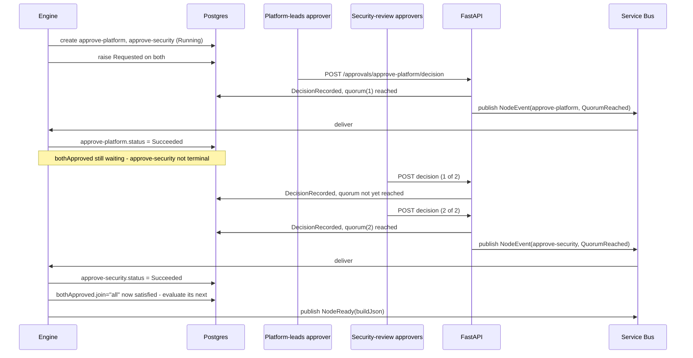

Each group's approvers only ever see and act on their own node — an "agent" approving is just a group member calling the same two endpoints with a service credential instead of a browser session. Nothing about combining groups lives inside the approval kind; the downstream switch decides, so the identical mechanism handles three groups, five groups, or a mix of approval and non-approval predecessors without the approval kind ever needing to change.

#### 8.1.1 Agent-evaluated approvals

Saying "an agent approves the same way a human does" answers *how* it calls the API, not *how it decides what to call*. A human reads the request and uses judgment; an agent needs that judgment made explicit. That's `config.decisionInstructions` (§6.4) — a JSONata-resolvable string on the `approval` node itself, so it can reference the same `$trigger`/`$vars`/`$context` as everything else:

```json
{
  "id": "approve-platform", "kind": "approval", "version": 1,
  "name": "Platform leads approval",
  "config": {
    "groupId": "platform-leads",
    "quorum": 1,
    "decisionInstructions": "Approve if $trigger.sku is in ['Standard_DS3_v2','Standard_DS4_v2'] and $vars.run.estimatedMonthlyCost < 5000. Reject with a comment citing the specific rule if either condition fails. Escalate (reject, comment 'needs human review') if the request mentions a region not in $vars.global.approvedRegions."
  },
  "next": [ { "to": "bothApproved" } ]
}
```

This one field does two jobs at once: the Approval Inbox (§14.4) renders it as inline policy text for a human, and it's exactly what an agent member reads as its decision prompt — one source of truth for "what does approving this actually mean," not a policy written once for people and separately reverse-engineered by whoever wires up the agent.

`approval_group_member.member_type` (§4) is what makes a group's composition explicit rather than a convention nobody enforces — a `human` member's `identity` is an email, an `agent` member's is a connection alias resolving to a model/agent connector. From there, two modes, chosen per member via `auto_decide`:

- **Self-polling (`auto_decide: false`, the default)** — no different from §8.1's sequence diagram above: the agent is an external actor with a service credential, calling `GET /approvals/pending?approverId=` on its own schedule, reading `decision_instructions` off the pending request, reasoning with its own model, and calling `POST /approvals/{id}/decision` like anyone else. The Engine does nothing differently — it doesn't know or care that the caller wasn't a browser.
- **Engine-invoked (`auto_decide: true`)** — the Engine evaluates that member's decision itself, inline, the moment the request is created, using the same executor pattern as `agent.loop` (§6.4) but as a single bounded call rather than an iterating loop: feed it `decision_instructions`, the trigger payload, and `$context`; expect back `{ decision, comment }`; record it as an `approval_decision` row with `decided_by_type: "agent"` exactly as if that call had hit the API.

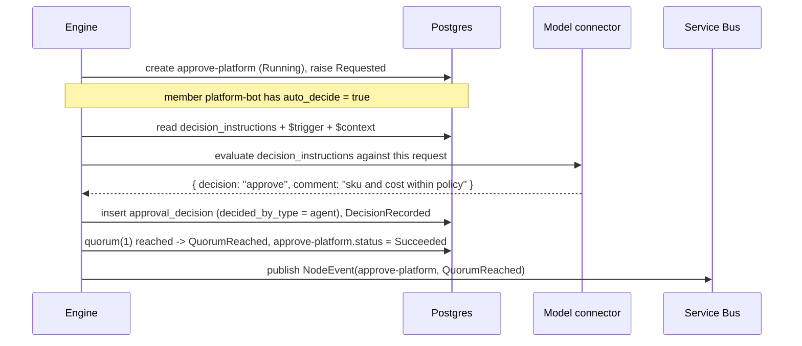

Either mode produces the same `DecisionRecorded`/`QuorumReached` events (§6.2) with the same shape — `decided_by_type` is what the Audit Trail (§14.5) uses to show "approved by platform-bot (agent)" instead of a person's name, not a different event vocabulary. A group can mix both: a fast agent pre-screen with `auto_decide: true` plus a human member as a second required signer under the same quorum, with no special-casing anywhere in the approval kind itself.

### 8.2 Fan-out / fan-in and the agentic loop

Static fan-out needs no special kind — a node with more than one `next` entry and no discriminating `when` simply has every target become eligible independently. Dynamic fan-out — an unknown-until-runtime array — is `control.forEach`: it evaluates a JSONata expression against prior output, then creates one `node_execution` per item, each with a distinct `iteration_key`, up to a concurrency cap. Fan-in, in both cases, is just the `join` field on whichever downstream node has more than one structural predecessor. The agentic loop node stays opaque to the surrounding graph either way — internally it runs its own bounded tool-calling loop and logs each iteration as a non-terminal event, but presents one input and one output to whatever node lists it as a predecessor.

### 8.3 Runtime variable mutation & stop

`control.setVariable` writes a scoped or global `rw` variable at runtime (§5.2). A stop request (`POST /runs/{runId}/stop`) is honored gracefully: the current node finishes, the next node never starts, and node kinds may optionally define a compensation handler for side effects already committed — nothing is silently rolled back.

### 8.4 Poll-until — a single-phase wait

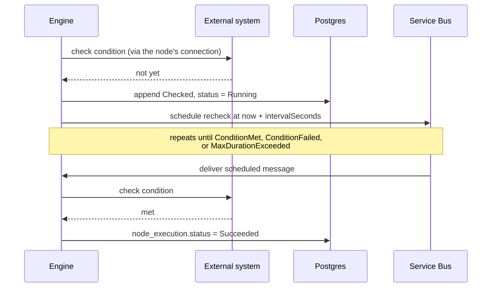

This is a scheduled Service Bus message (delayed enqueue), not a busy Function instance sitting in a loop — each check is its own short-lived invocation, which is both cheaper and survives a Function cold restart between checks. This is the shape for a single condition against a single value. §13.2 walks through what changes once a wait needs more than one phase — the GitHub Actions status check in the reference scenario is exactly that case, and gets its own kind (§6.2) rather than living here.

---

## 9. Connections

A connection's secret material lives in Key Vault and is never embedded in workflow JSON — a workflow only ever carries an alias.

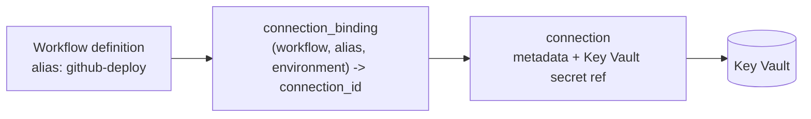

Alias resolution happens once, at trigger time — the API resolves every alias the pinned workflow version declares into a concrete connection for the current environment and snapshots that map onto the `workflow_run` row. The same published JSON promotes from dev to prod untouched; only the binding table changes per environment. A node's own `connections` map (§5.5) picks which alias fills which of its required roles.

---

## 10. Policies: Retry, Timeout, Idempotency

Retry and timeout live under a single `policies` object on the node rather than as top-level fields, since this is where a concurrency limit, a caching policy, or a circuit-breaker would land later without the node schema growing a new top-level key every time.

```json
"policies": {
  "retry":   { "maxAttempts": 3, "backoff": "exponential", "initialDelaySeconds": 15,
               "retryableErrors": ["Http5xx", "Timeout"] },
  "timeout": { "seconds": 60 }
}
```

Service Bus and Azure Functions are at-least-once — any action node can be invoked twice for the same logical step. The idempotency key (`run_id:node_id:iteration_key:attempt`) is what a connector implementation is expected to pass through to the target system where that system supports it (an idempotency header, a deterministic commit message tag), and at minimum it's what stops the Engine itself from creating a second `node_execution` row for a redelivered message. A node exceeding `policies.retry.maxAttempts` or `policies.timeout` without a defined failure branch fails the run; a workflow-level `onError` handler catches that instead of every node needing its own.

---

## 11. API Surface

| Method & path | Purpose |
|---|---|
| `POST /workflows/{id}/versions` | Save a new draft version. |
| `POST /workflows/{id}/versions/{v}/publish` | Freeze a version; assigns the permanent version number. |
| `POST /workflows/{id}/trigger` | Validate trigger payload, resolve connection bindings, create the run, publish `RunStarted`. |
| `GET /runs/{runId}` | Current run + node status. |
| `GET /runs/{runId}/events?nodeId=&eventType=&since=&cursor=` | Full ordered audit trail, filterable and paginated — backs the Audit Trail screen (§14.5) directly. |
| `POST /runs/{runId}/stop` | Sets `stop_requested_at`; Engine honors it before the next node starts. |
| `GET /approvals/pending?approverId=` | What a user or agent can act on right now. |
| `POST /approvals/{id}/decision` | Approve or reject; evaluates the node's gate. |
| `GET /node-kinds` | Registry, for the visual builder's node palette. |
| `POST /connections` | Register connection metadata (secret goes straight to Key Vault). |

---

## 12. Global Error Handling

A workflow may declare a top-level `onError` handler (`{ "to": "<nodeId>" }`). Any node that exhausts retries, times out, or otherwise fails **without** a defined failure branch in its own `next` routes to this handler instead of failing the run silently — see §13.4 for a concrete instance.

---

## 13. Reference Scenario: Azure Databricks Provisioning

A user requests an Azure Databricks workspace, enters the required data, the request goes to parallel approval from two groups, once approved the engine builds a deployment JSON, commits it to a specific branch/path in a GitHub repo, that commit triggers a GitHub Actions deployment workflow, the engine watches that run to completion, and finally emails the requester.

### 13.1 Node graph

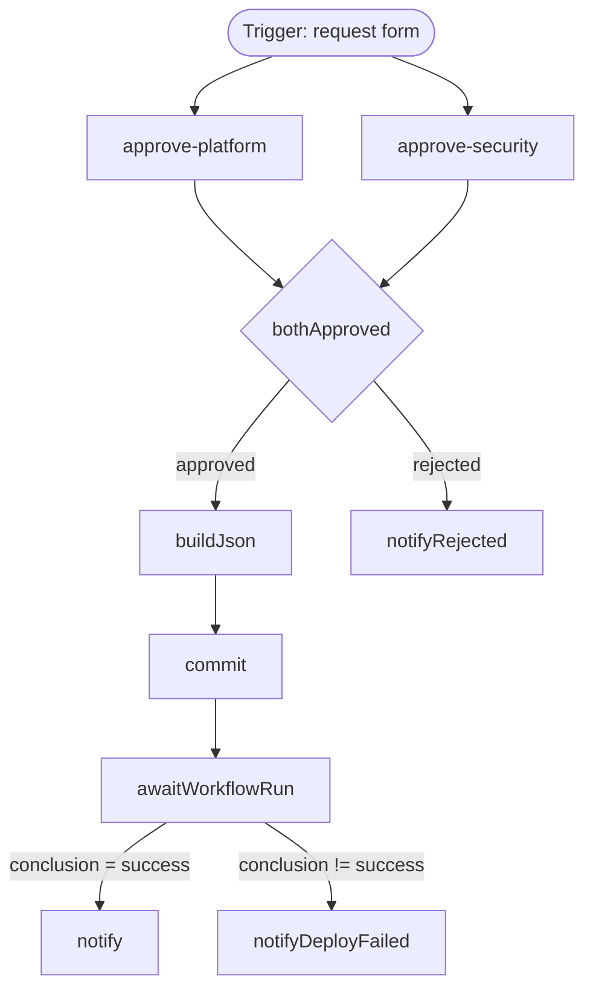

This is exactly what the React Flow canvas renders — no translation layer between the published JSON and the visualization.

### 13.2 Why the GitHub Actions check is a custom kind

"Commit to GitHub, that triggers a workflow" hides a real gap: a push-triggered Actions run doesn't hand back a run id, and `workflow_dispatch` has the same gap from the other side — that call doesn't return one either. The fix is the commit's own SHA: GitHub's list-runs endpoint accepts `head_sha` as a filter, so once `commit` returns the SHA it just wrote, finding the run it caused is unambiguous no matter what else is happening in the repo.

That's two different GitHub calls, hit in sequence, with different intervals and different timeouts — expressing that as generic `checkExpression` strings on `control.pollUntil` would work but be unreadable and fragile. So it isn't `control.pollUntil`: it's its own kind, `action.github.awaitWorkflowRun` (§6.2), with the two-phase logic written into its executor rather than configured. It is still exactly **one node** — the phases live inside its own `state`, never as a second node in the graph (§6.3 has the full manifest and tick-by-tick trace).

### 13.3 Component-level walkthrough

The workflow JSON is the graph; it says nothing about which system does what. Three diagrams, one per phase, name every component that actually touches this scenario.

**Phase A — request, form, and approval**

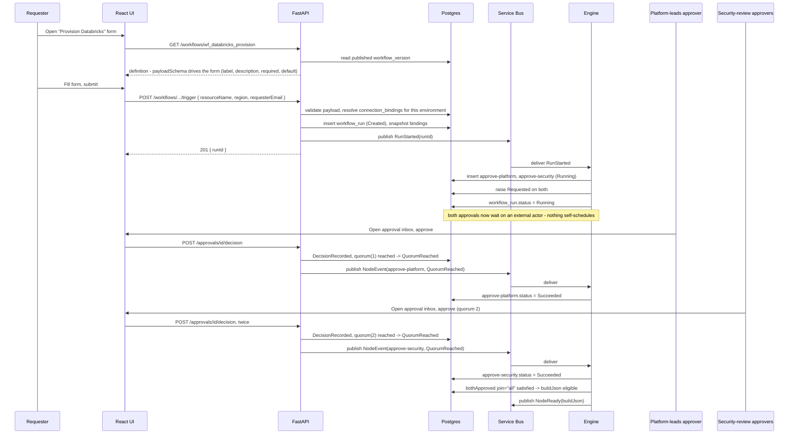

**Phase B — build, commit, and watch the deployment run**

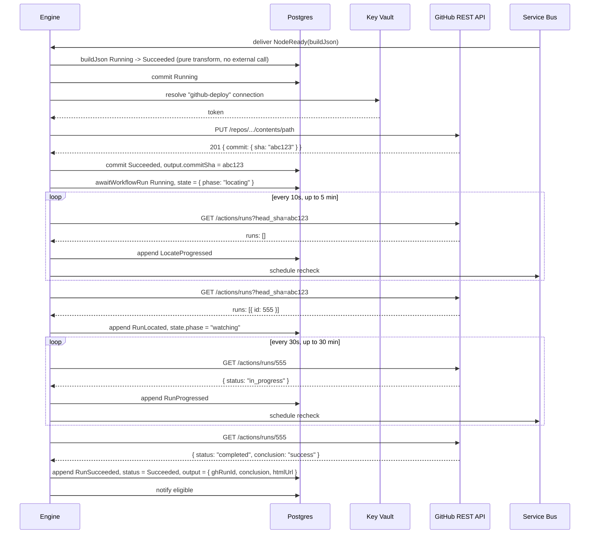

**Phase C — live status in the UI, and notification**

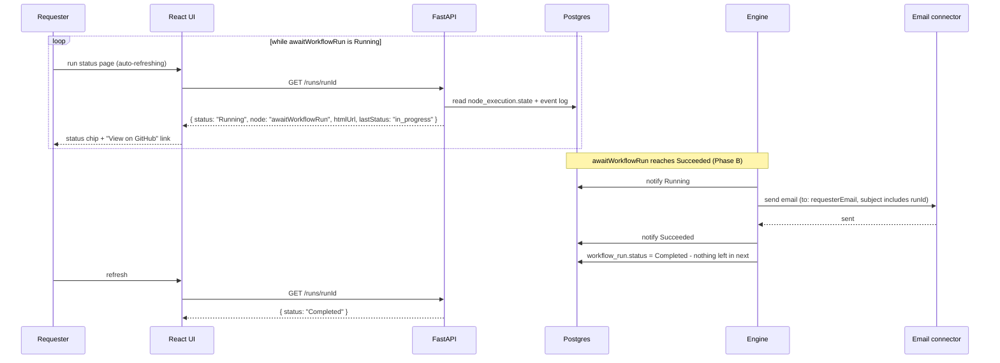

### 13.4 Error handling in this scenario

Two failure paths are modeled explicitly in the graph because they're expected business outcomes, not infrastructure faults: rejection (`notifyRejected`) and a deployment that ran but concluded unsuccessfully (`notifyDeployFailed`). Everything else — a commit that exhausts its retries, a locate phase that never finds a run inside 5 minutes — routes through the workflow-level `onError` handler (§12) to `notifyOpsFailure`, a platform-eng alert distinct from either requester-facing email.

---

## 14. UI Screens

The UI has two audiences — people building and publishing workflows, and people running, monitoring, and approving them. None of the screens below are a separate design exercise: each is a direct read or write against the schema and API surface already defined in §5–§11, so a new node kind or event type needs no UI change beyond what the generic mechanisms already handle.

### 14.1 Workflow Designer / Builder

- Canvas (React Flow) rendering `nodes` and each node's own `next` list (§5.4) directly — node position from `layout` when present, auto-laid-out when absent.
- Node palette sourced live from `GET /node-kinds`, grouped by the categories in §6.1.
- **Node inspector**: selecting a node renders a form generated from that kind's input/config schema, built from the §5.1 field shape (`type`/`label`/`description`/`required`/`default`) — a new node kind becomes editable with zero UI code. An "Events" section on the same panel lists that kind's event catalogue (§6.2) — each event's name, whether it's terminal, and its `description` — so an author can see what a node is actually capable of doing (and which of those outcomes end it) before ever running it.
- **Connections panel**: for a node's declared roles (§5.5), a dropdown per role picks a workflow-level alias; a separate workflow-level "Connections" tab manages the alias list and its per-environment bindings (§9).
- **Variables panel**: global variables (read-only list, with a request-access action) and run-scoped variables (add/edit), each scope-tagged per §5.2.
- **Validation surface**: publish-time errors — a dangling `next` target, a write to a `ro` variable, a connection type mismatch, an unreachable node — shown inline on the offending node; Publish stays disabled until they clear.
- Draft/Published version selector (§7.1 pinning is what makes switching versions here safe); raw JSON import/export as an escape hatch, kept in sync with the canvas.

### 14.2 Trigger / Run Form

Generated purely from `trigger.payloadSchema` (§5.1, §5.6) — the same rendering component as the node inspector in §14.1, not a second implementation. Submitting calls `POST /workflows/{id}/trigger` and opens the Run Execution view (§14.3) for the returned `runId`.

### 14.3 Run Execution / Status View

- The same graph component as the Designer, read-only, each node color-coded by its live `status` (§7.2).
- Selecting a node opens a detail drawer showing `input_snapshot`, and once terminal, `output`. A node still `Running`/waiting shows a kind-specific summary rendered from its `state` — e.g. `awaitWorkflowRun` shows its current phase and a "View on GitHub" link straight from `state`, matching §13.3 Phase C.
- Run-level header: overall `workflow_run.status`, started-by/at, and a Stop button (`POST /runs/{runId}/stop`) disabled once the run is terminal.

### 14.4 Approval Inbox

- Personal list from `GET /approvals/pending?approverId=`, grouped by group, each row showing the relevant trigger-payload context and quorum progress ("1 of 2 needed").
- Approve/Reject with an optional comment, posting to `POST /approvals/{id}/decision`.

### 14.5 Audit Trail

- A chronological, filterable table reading `GET /runs/{runId}/events` directly — every row is one `event` table row: sequence, timestamp, node id, event type, and an expandable payload viewer.
- Filters by node, event type, and time range are necessary in practice: a single `pollUntil`/`awaitWorkflowRun` node can log dozens of non-terminal rows (`Checked`, `RunProgressed`) over one run.
- This is the completeness guarantee from §4 made visible — every event, terminal or not, shows up here, and every `eventType` that can appear in this table is drawn from the full per-kind catalogue in §6.2, nothing ad hoc.
- Linked both ways: a node's detail drawer in §14.3 deep-links into its slice of the trail, and the trail is also available as a standalone tab per run.

### 14.6 Workflow Catalogue

List of workflows with their draft/published versions and recent runs — the landing page tying the other screens together.

---

## 15. Open Items / Follow-ups

- Confirm the exact JSON shape `buildJson` hands to the target repo's deployment pipeline (Terraform tfvars vs. Bicep parameters vs. custom manifest).
- Define the `github-deploy` connection type's required scopes (`contents:write`, `actions:read` at minimum).
- Confirm the recipient list/routing behind `notifyOpsFailure`.
- Platform-level global variable registry: how globals are registered, and who can grant a workflow read/write access to one.
- Node kind SDK / plugin packaging for third parties adding new connectors.

---

## 16. Versioning Strategy

The word "version" already appears on three unrelated things in this spec — a workflow's own revision history, a node's `kind`+`version` reference, and (implicitly) the shape of the JSON envelope itself. Conflating them is how a system ends up unable to answer "is it safe to change this" precisely. Each gets its own rule.

### 16.1 Workflow version — a specific workflow's content over time

Already governed by decision #4 (Appendix A): `workflow_version.version_number` is monotonic per workflow, assigned on publish, and `definition` is immutable from that point on. What this section adds:

- **Creation is always copy-on-write.** Editing a published workflow opens a new `draft` `workflow_version` seeded from the version being edited; there is no in-place edit of a published row, ever.
- **Old published versions are never deleted**, only `archived` — archiving removes a version from the trigger-time default (next bullet) and from the Catalogue's (§14.6) primary listing, but any `workflow_run` already pinned to it keeps reading it forever, and it stays directly triggerable by version number for anyone who still needs to.
- **A trigger targets a version, not "the workflow."** `POST /workflows/{id}/trigger` defaults to the newest `published` version, but accepts an optional `versionNumber` to target an older (non-archived) one explicitly — this is what makes a canary or staged rollout possible without a separate mechanism: point a subset of triggers at the new version, leave the rest on the old one, promote the default once satisfied.
- **A running instance never moves versions.** Decision #4 already covers this; restated here because it's the anchor every other rule in this section depends on — nothing below is allowed to break an in-flight run's ability to keep reading the exact version it started on.

### 16.2 Node kind version — a kind's own contract over time

`node_kind_definition` (§4) keyed by `kind`+`version` is what lets a published workflow reference a connector's behavior without that behavior silently changing underneath it (§6.1's opening line). The policy that makes that guarantee real:

- **A version bump is required for any breaking change**: removing or renaming an input/output/config field, changing a field's `type`, removing or renaming an event, or changing what a terminal event maps to (its `resultStatus`). Any of these would change the runtime behavior of every already-published workflow using that kind if applied in place — which is exactly what pinning a node to `kind`+`version` exists to prevent.
- **A non-breaking addition may ship under the same version**: a new optional config field with a default, or a new non-terminal event that doesn't touch existing terminal semantics. Existing workflows are unaffected and don't need to opt in to see it — the field simply doesn't appear in their `input_snapshot` until they add it.
- **Old versions are never deleted from the registry.** The same immutability guarantee that applies to `workflow_version.definition` extends transitively to every node kind version it can reference — a run publishing today against `action.github.commit` v1 must still resolve v1's executor a year from now, even after v3 ships.
- **Deprecation, not removal.** `node_kind_definition.deprecated` (§4) plus `deprecated_message` blocks *new* usage — publish-time validation rejects a workflow version that adds a node targeting a deprecated kind version, and the Designer's palette (§14.1) hides deprecated versions behind an explicit "show deprecated" toggle. It does nothing to workflows already published against it; those keep running exactly as before.
- **Migration is manual, by design.** There's no automatic rewrite of a node's `version` field across a workflow's history — an author opens a new draft, bumps the version, and adjusts `config`/`inputs` to match the new contract, the same way they'd handle any other breaking dependency upgrade. The registry entry's own changelog (a `notes` field per version, not modeled as a separate table here) is what the Designer can diff against to show "what changed between v1 and v2" while they do it.

### 16.3 Workflow JSON envelope/schema version

Distinct from both of the above: the shape of the JSON document itself — the fact that it has a top-level `nodes` array, a `trigger` object, edges as `next` rather than a separate list (§5.4) — is its own thing to version, because it can change independently of any single workflow's content or any single node kind's contract. A top-level `schemaVersion` (e.g. `"schemaVersion": 1`, sitting next to `workflowId`) is what a parser dispatches on, so that if the envelope shape itself ever needs to change — say, `trigger` becoming `triggers: []` to support more than one trigger kind — every historical `workflow_version.definition` row (immutable, per §16.1) keeps parsing under the schema version it was written against, with no backfill or rewrite required. This is the same append-only philosophy as the `event` table (§4) applied to the definition format itself.

### 16.4 Connection types

A connection `type` (§9) versions the same way a node kind does, for the same reason: `connection.type_version` (§4) exists because a connection type's own contract can change — GitHub requiring an additional OAuth scope, an SMTP connector adding a required `fromDomain` field — independent of any workflow or any node kind that happens to use a `github`- or `smtp`-typed role. The same rules apply: a scope/field addition that doesn't break an existing binding can ship under the same `type_version`; anything that would invalidate an existing `connection_binding` (§4) needs a new one, and old bindings keep resolving against whatever `type_version` they were created under.

---

## Appendix A: Decision Log

| # | Decision | Rationale |
|---|---|---|
| 1 | Approval gating is configurable per node — AND/OR across groups, quorum within a group — later refined to be **composed structurally**: one `approval` node per group plus a downstream `control.switch` with a `join`/`when` policy, rather than a gate config baked into the approval kind. | Generalizes to any "did enough prior steps succeed" gate, not just approvals; keeps the approval kind itself trivial. |
| 2 | Expression language is JSONata everywhere (inputs, `when`, edge `metadata`, config). | One consistent, learnable syntax; enables static reference-validation at publish time. |
| 3 | Agentic loop is its own node kind — LLM chooses actions and the stop point, bounded by iteration/cost/timeout caps. | Distinct failure modes and guardrails from a deterministic loop; needs its own event vocabulary. |
| 4 | A run pins to the exact workflow version it started on; edits never affect in-flight runs. | Matches Temporal/Step Functions semantics; avoids a running instance hitting a graph shape it didn't start with. |
| 5 | Stop is graceful only, with an optional per-node compensation handler; no automatic rollback of committed side effects. | Side effects (e.g. a GitHub commit) generally can't be safely auto-reverted; explicit is safer than silent. |
| 6 | Connections are referenced by a logical alias, resolved to a concrete connection per environment at trigger time. | Same published JSON promotes across environments untouched. |
| 7 | Sub-workflow composition deferred to a later phase. | Keeps v1 scope and schema smaller; revisit once the core engine is proven. |
| 8 | Fan-in defaults to `join: "all"`, overridable to `any` or an explicit N-of-M. | Matches the common case; explicit override covers races and partial-completion patterns. |
| 9 | Control flow lives on the node as `next` (with `when` and `metadata`), not a separate top-level edge array. | One source of truth per node; matches the shape a graph-based visual builder wants natively. |
| 10 | `variables` is a dictionary keyed by scope then name, not an array; scopes are `trigger` / `global` / `run` / `iteration`. | Removes ambiguity about which scope a variable belongs to; array-of-objects made scope an easy-to-miss field. |
| 11 | A `$context` object (workflowId, runId, environment, node identity) is a fourth expression root alongside `$trigger`/`$vars`/`$node`. | Needed for traceability (tagging commits/emails with the run id) without polluting `$vars`. |
| 12 | Every schema-defining block uses one field shape: `{ type, label, description, required, default }`. | One convention for the visual builder to render forms from, wherever a schema appears. |
| 13 | `type`/`typeVersion` on a node instance renamed to `kind`/`version`. | Naming clarity — "type" was overloaded with data-type usage elsewhere in the schema. |
| 14 | A node's connection reference is a `connections` map of named roles, not a single `connection` string. | A node can require more than one connection (e.g. source + destination). |
| 15 | Retry and timeout live under a single `policies` object on the node. | Leaves room for future policies (concurrency, caching, circuit-breaker) without new top-level node keys. |
| 16 | The GitHub Actions status check is a single custom node kind (`action.github.awaitWorkflowRun`) with an internal two-phase state machine, not two graph nodes and not generic `control.pollUntil` config. | Two sequential GitHub API calls with different cadences/timeouts is API-specific logic that belongs in an executor, not in fragile config strings; the graph should show one status change for one logical wait. |
| 17 | `node_execution` has both `state` (opaque, executor-only, mutable while non-terminal) and `output` (set once, on the terminal event, the only one exposed downstream). | Makes explicit which data is a kind's private working scratchpad versus its public result — the root of "how terminal events are handled." |
| 18 | Every event in a kind's manifest carries a `description`, using the same field shape as everything else (§5.1, decision 12) — not just an event `type` and `terminal`/`resultStatus` flag. | An author picking a node in the Designer needs to know what a node can actually do in plain language, not decode kind-specific enum names; also makes the §6.2 catalogue the single source of truth for every `eventType` the Audit Trail can ever show. |
| 19 | An agent group member's decision policy is authored once, as `approval.config.decisionInstructions` (§8.1.1), and read by both the human-facing Approval Inbox and an agent member's own reasoning — not written twice in two different places. | One source of truth for "what does approving this mean"; an agent's decision logic can't silently drift from what a human reviewing the same node sees. |
| 20 | An agent approval member supports two modes — self-polling (`auto_decide: false`, default) or Engine-invoked inline (`auto_decide: true`) — both producing the same `DecisionRecorded`/`QuorumReached` events, distinguished only by `decided_by_type` (§4, §8.1.1). | Lets a fully external agent integrate with zero Engine changes (matches decision on approval composability), while still offering a first-class inline option without inventing a second event vocabulary for machine decisions. |
| 21 | Versioning is three independent axes — workflow version (§16.1), node kind version (§16.2), and workflow-envelope `schemaVersion` (§16.3) — each with its own bump/deprecation/immutability rules, rather than one overloaded "version" concept. | Each axis changes for a different reason and on a different cadence (a workflow author publishing a draft vs. a platform team shipping a breaking connector change vs. the JSON format itself evolving); conflating them makes it impossible to state precisely what's safe to change. |
| 22 | A node kind version bump is required only for breaking changes (removed/renamed field, changed field type, removed/renamed event, changed terminal→status mapping); additive, backward-compatible changes ship under the same version (§16.2). | Matches how the rest of the schema already treats compatibility (optional fields with defaults, per decision 12); avoids a version-number bump — and the deprecation/migration overhead that implies — for changes that affect no existing workflow. |

--